# Head First Design Pattern

## 策略模式
### 用到的原则
1. 将变化和不变化的地方找出来，分离
2. 针对接口编程，而不是针对实现编程（接口就是所谓的抽象一层的东东，而不单指 java 接口）
3. 多用组合，少用继承 （意思是少用继承来分离代码）

### 第 25 页练习
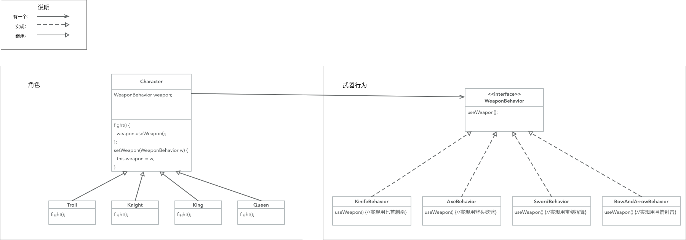

## 观察者模式
### 原则
1. 以松耦合的方式让一系列对象沟通状态（让格对象数据的派发和观察不耦合在一起）

### 第 56 页练习
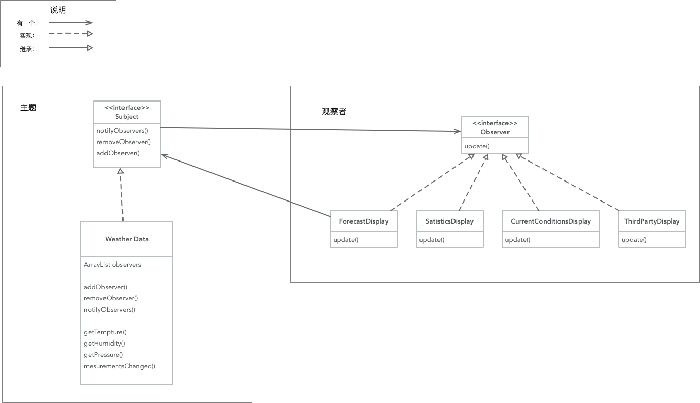

## 装饰者模式
### 用到的新原则
1. 对扩展开放，对修改关闭（让基本的数据不变，通过扩展让类增加功能或者加强原有功能）

### 优缺点
1. 优点：让类经常会修改变化的方法或者功能通过扩展来增加灵活性
2. 缺点：会定义十分多的类，一不留神会让程序变得复杂

### 第 91 页的例子
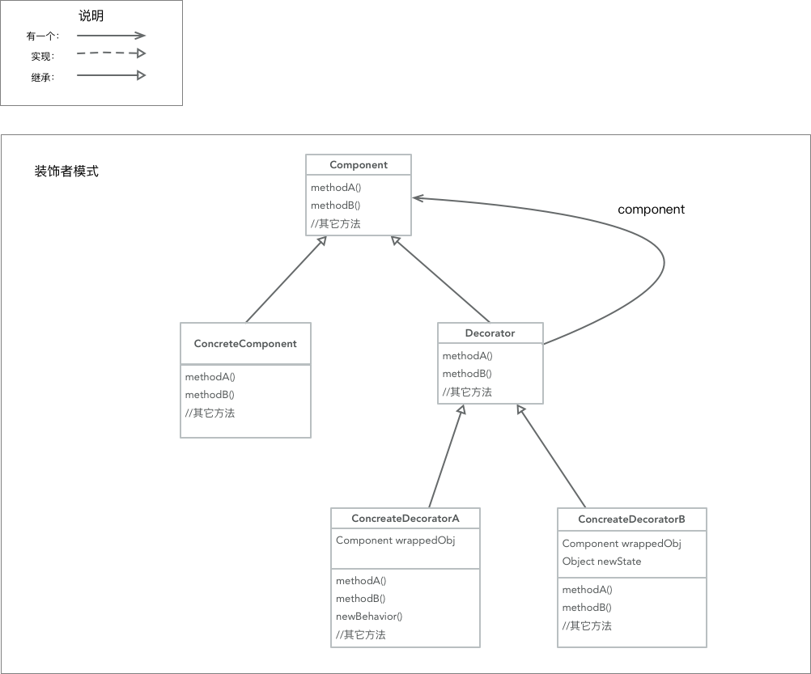

## 工厂模式
### 简单工厂
#### 说明
1. 就是简单的把创建对象的语句抽离出去，作为一个对象

#### 第 117 页的例子

### 工厂方法
#### 用到的原则
1. 依赖倒置，依赖抽象，不要依赖具体类

#### 说明
1. 将创建对象的方法放到子类里面，要子类决定创建，还让子类可以修改它们的行为

#### 第 134 页的例子
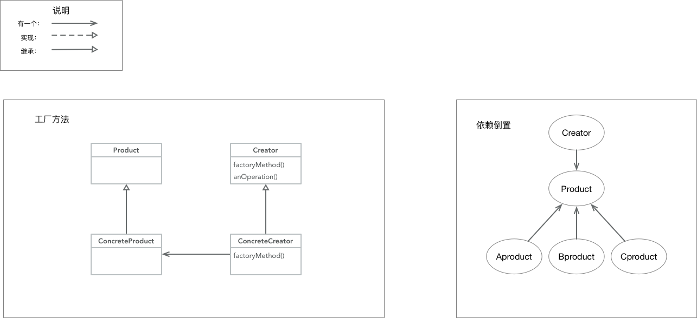

### 抽象工厂
#### 指导方针规则
1. 变量不可以持有具体的引用 （意思是：不能写死）
2. 不要让类派生具体类（意思是：根源的类不能够是具体类, 要依赖抽象）
3. 不要覆盖基类中已实现的方法（意思是：如果根源的类是改变了它继承类的方法，那么它就不适合被别的类继承了）

#### 说明
1. 如果类里面有一系列的类, 那么可以通过抽象工厂来提供这一系列的类的对象，方便以后快速更改配置

#### 第 156 页的例子
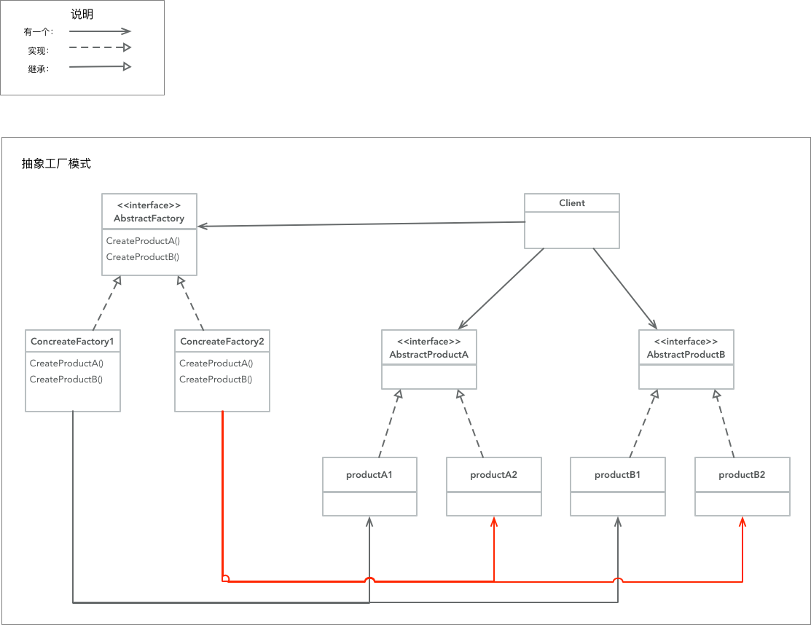

## 单件模式
### 意义
确保一个类只有一个实例，并提供一个全局的访问点

### 例子
并没有，这个主要关注代码层面的，留意一下多线程访问的问题就好了

## 命令模式

### 说明
将 `请求` 封装成对象，以便使用不同的请求，队列或者日志来参数化其它对象。命令模式也支持可撤销操作。

其中的 `请求` 意思是：让相应的类执行相应的操作

### 意义
1. 命令模式将发出请求的对象和执行请求的对象解耦 (就是将调用者和被执行者进行解耦)
2. 将对象执行的动作封装起来

### 第 206 页的例子
将执行变为一种请求
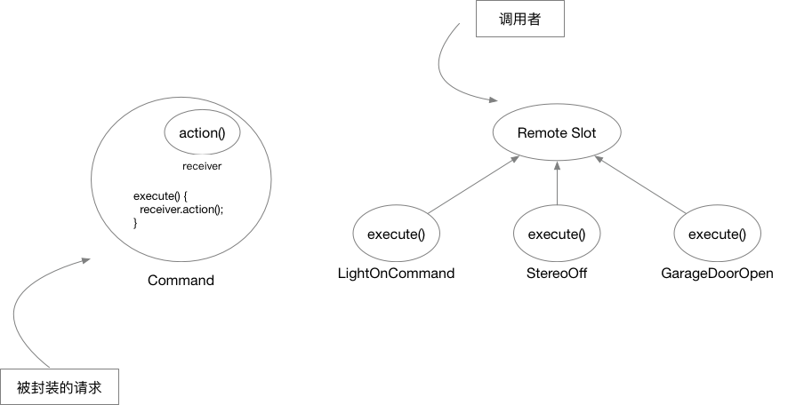

### 第 207 页的例子
调用者 invoker 会在某时刻，调用命令对象的 `execute()`
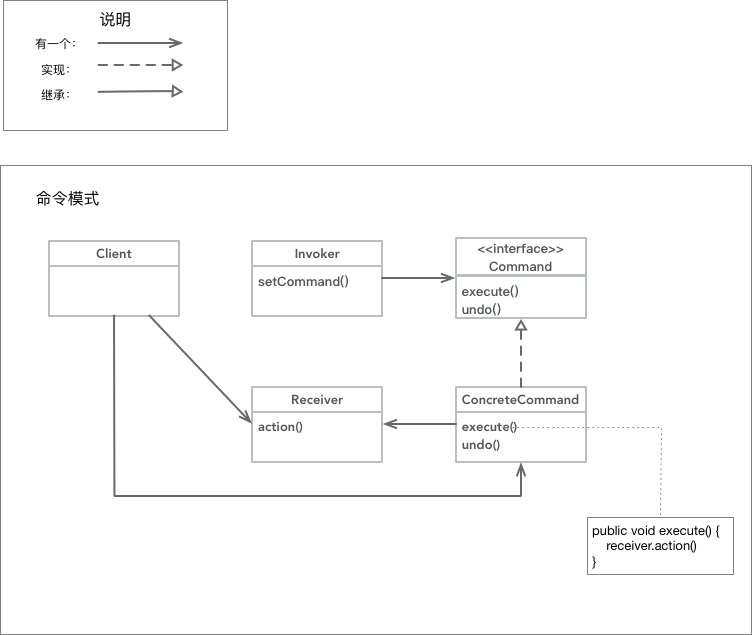

## 适配器模式

### 说明
将一个类的接口，转换成客户期望的另一个接口。适配器让原本接口不兼容的类可以合作无间

### 第 243 和 244 页的例子
一个利用接口，一个利用多重继承来实现

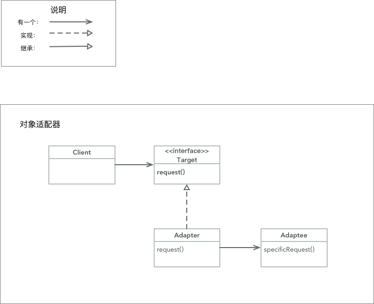
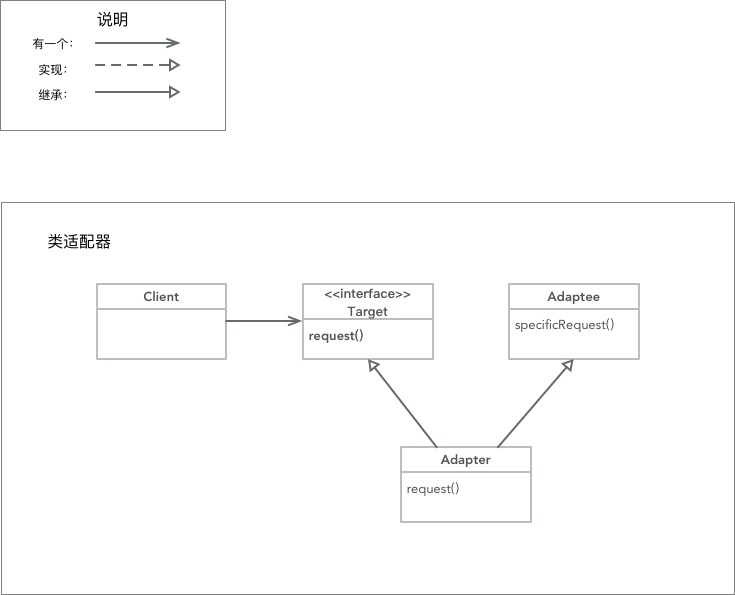

## 外观模式
### 说明
提供了一个统一的接口，用来访问子系统中的一群接口，外观定义了一个高层接口，让子系统更容易使用。

### 规则
- 最少知识原则：只和你的密友对话
- 意思是：减少对象之间的交互，只留几个 "密友" 对象

### 方针
只调用以下范围的方法
- 该对象本身 （自身）
- 被当做方法的参数而传递进来的对象 (输入)
- 此方法所创建或实例化的任何对象 (自身生成的对象)
- 对象的任何组件 (自身拥有的对象关系)

### 第 264 页的例子
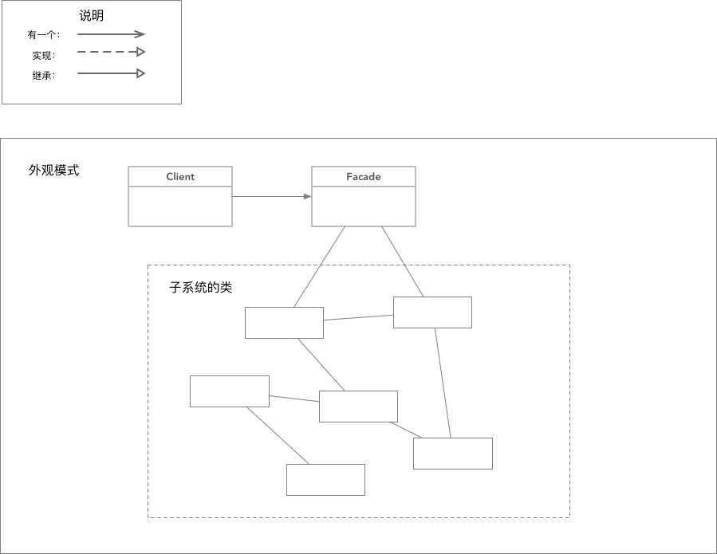

## 模板方法模式

### 说明
- 在一个方法中定义一个算法的骨架，而将一些步骤延迟到子类中。
- 模板方法使得子类可以在不改变算法结构的情况, 重新定义算法中的某些步骤
- 意思：模板方法定义了一个算法的步骤，允许子类为一个或多个步骤提供实现
- 工厂方法是模板方法的一种特殊版本

### 钩子
- 可以在模板方法里面提供 "默认不做事的方法" (钩子) 
- 子类可以视情况决定要不要覆盖它们
- 如：一些 Activity 或者 Controller 的 willLunch 等就是用 hock 实现的

什么时候用：
- 当方法必须实现就用 `抽象方法` 
- 当非必须就用 `钩子`

### 好莱坞原则
- 别调用(打电话给)我们，我们会调用(打电话给)你
- 意思：防止 `依赖腐败` 避免高组件依赖底层组件，底层又依赖高层，高层又依赖侧边
- 总之：就是避免让高层和低层组件之间有明显的环状依赖
- 由超类主控一切

### 第 289 页的例子
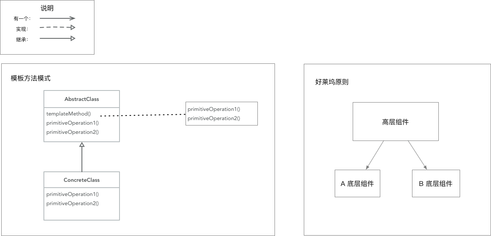