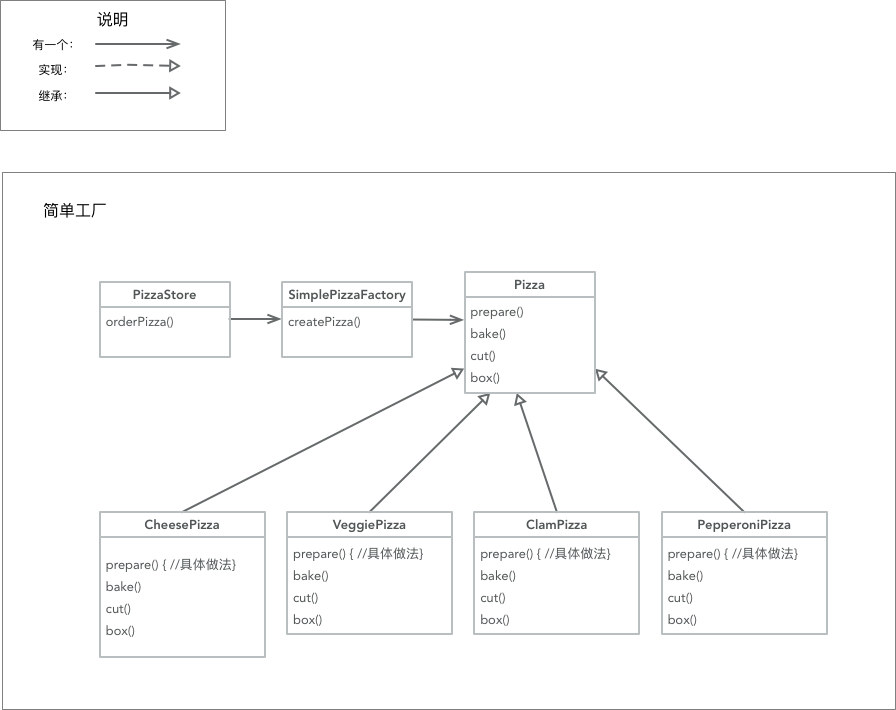

# Head First Design Pattern

[Head First 设计模式](https://book.douban.com/subject/2243615/) 的笔记

12 个常用的设计模式，以一段说明，一张 UML 图的形式记录，方便学习和回顾

因为书里主要是以 Java 为主的，所以要有一点了解，还需一点对象的基础

## Table of Contents
=================
   * [Head First Design Pattern](#head-first-design-pattern)
      * [OO原则](#oo原则)
      * [策略模式](#策略模式)
      * [观察者模式](#观察者模式)
      * [装饰者模式](#装饰者模式)
      * [工厂模式](#工厂模式)
         * [简单工厂](#简单工厂)
         * [工厂方法](#工厂方法)
         * [抽象工厂](#抽象工厂)
      * [单件模式](#单件模式)
      * [命令模式](#命令模式)
      * [适配器模式](#适配器模式)
      * [外观模式](#外观模式)
      * [模板方法模式](#模板方法模式)
      * [迭代器与组合模式](#迭代器与组合模式)
         * [迭代器模式](#迭代器模式)
         * [组合模式](#组合模式)
      * [状态模式](#状态模式)
      * [代理模式](#代理模式)
      * [模式](#模式)
         * [用模式思考](#用模式思考)
      * [反模式](#反模式)
      * [剩下的模式](#剩下的模式)

## OO原则
- 封装变化
- 多用组合，少用继承
- 针对接口编程，不针对实现编程
- 为交互对象之间的松耦合设计而努力
- 类应该对扩展开放，对修改关闭
- 依赖抽象，不要依赖具体类
- 只和朋友交谈
- 别找我，我会找你
- 类应该只有一个改变的理由

## 策略模式
### 用到的原则
1. 将变化和不变化的地方找出来，分离
2. 针对接口编程，而不是针对实现编程（接口就是所谓的抽象一层的东东，而不单指 java 接口）
3. 多用组合，少用继承 （意思是少用继承来分离代码）

### 第 25 页练习

## 观察者模式
### 原则
1. 以松耦合的方式让一系列对象沟通状态（让格对象数据的派发和观察不耦合在一起）

### 第 56 页练习

## 装饰者模式
### 用到的新原则
1. 对扩展开放，对修改关闭（让基本的数据不变，通过扩展让类增加功能或者加强原有功能）

### 优缺点
1. 优点：让类经常会修改变化的方法或者功能通过扩展来增加灵活性
2. 缺点：会定义十分多的类，一不留神会让程序变得复杂

### 第 91 页的例子

## 工厂模式
### 简单工厂
#### 说明
1. 就是简单的把创建对象的语句抽离出去，作为一个对象

#### 第 117 页的例子

### 工厂方法
#### 用到的原则
1. 依赖倒置，依赖抽象，不要依赖具体类

#### 说明
1. 将创建对象的方法放到子类里面，要子类决定创建，还让子类可以修改它们的行为

#### 第 134 页的例子

### 抽象工厂
#### 指导方针规则
1. 变量不可以持有具体的引用 （意思是：不能写死）
2. 不要让类派生具体类（意思是：根源的类不能够是具体类, 要依赖抽象）
3. 不要覆盖基类中已实现的方法（意思是：如果根源的类是改变了它继承类的方法，那么它就不适合被别的类继承了）

#### 说明
1. 如果类里面有一系列的类, 那么可以通过抽象工厂来提供这一系列的类的对象，方便以后快速更改配置

#### 第 156 页的例子

## 单件模式
### 意义
确保一个类只有一个实例，并提供一个全局的访问点

### 例子
并没有，这个主要关注代码层面的，留意一下多线程访问的问题就好了

## 命令模式

### 说明
将 `请求` 封装成对象，以便使用不同的请求，队列或者日志来参数化其它对象。命令模式也支持可撤销操作。

其中的 `请求` 意思是：让相应的类执行相应的操作

### 意义
1. 命令模式将发出请求的对象和执行请求的对象解耦 (就是将调用者和被执行者进行解耦)
2. 将对象执行的动作封装起来

### 第 206 页的例子
将执行变为一种请求

### 第 207 页的例子
调用者 invoker 会在某时刻，调用命令对象的 `execute()`

## 适配器模式

### 说明
将一个类的接口，转换成客户期望的另一个接口。适配器让原本接口不兼容的类可以合作无间

### 第 243 和 244 页的例子
一个利用接口，一个利用多重继承来实现

## 外观模式
### 说明
提供了一个统一的接口，用来访问子系统中的一群接口，外观定义了一个高层接口，让子系统更容易使用。

### 规则
- 最少知识原则：只和你的密友对话
- 意思是：减少对象之间的交互，只留几个 "密友" 对象

### 方针
只调用以下范围的方法
- 该对象本身 （自身）
- 被当做方法的参数而传递进来的对象 (输入)
- 此方法所创建或实例化的任何对象 (自身生成的对象)
- 对象的任何组件 (自身拥有的对象关系)

### 第 264 页的例子

## 模板方法模式

### 说明
- 在一个方法中定义一个算法的骨架，而将一些步骤延迟到子类中。
- 模板方法使得子类可以在不改变算法结构的情况, 重新定义算法中的某些步骤
- 意思：模板方法定义了一个算法的步骤，允许子类为一个或多个步骤提供实现
- 工厂方法是模板方法的一种特殊版本

### 钩子
- 可以在模板方法里面提供 "默认不做事的方法" (钩子) 
- 子类可以视情况决定要不要覆盖它们
- 如：一些 Activity 或者 Controller 的 willLunch 等就是用 hock 实现的

什么时候用：
- 当方法必须实现就用 `抽象方法` 
- 当非必须就用 `钩子`

### 好莱坞原则
- 别调用(打电话给)我们，我们会调用(打电话给)你
- 意思：防止 `依赖腐败` 避免高组件依赖底层组件，底层又依赖高层，高层又依赖侧边
- 总之：就是避免让高层和低层组件之间有明显的环状依赖
- 由超类主控一切

### 第 289 页的例子

## 迭代器与组合模式

### 迭代器模式
#### 说明
- 提供一种方法: 顺序访问一个聚合对象中的各个元素，而又不暴露其内部的表示
- 意思是：封装不同的集合 (collection) 类型的遍历代码
- 集合 (collection) 指的是一群对象, 可以以各种数据结构存储，如数组，散列表，列表
- 集合 (collection) 也可称为聚合 (aggregate)
- 把游走的任务放在迭代器上，而不是聚合上。能简化聚合的接口和实现，让责任各得其所

#### 单一责任原则
- 一个类应该只有一个引起变化的原因
- 类的每个责任都有改变的潜在区域。超过一个责任，意味着超过一个改变的区域

#### 第 331 页的例子

#### 第 336 页的例子

### 组合模式

#### 说明
- 允许将对象组合成树形的结构来表现 `整体/部分` 层次结构
- 能让客户以一致的方式处理个别对象和组合对象
- 意思：处理的时候，可以忽略对象组合和个别对象之间的差别

#### 第 358 页的例子

## 状态模式

### 说明
- 允许对象在内部状态改变时改变它的行为
- 对象看起来好像修改了它的类
- 意思：让对象基于内部状态而拥有不同的行为

### 状态模式 vs 策略模式
策略模式:
- 继承之外的一种弹性替代方案
- 能通过组合不同的对象来改变行为
- 需用行为或者算法来配置 Context 类

状态模式：
- 允许 context 随着状态而改变行为
- 替代 context 里的条件判断，将行为包装进状态对象中
- 改变 context 里的状态对象，即可改变 context 的行为
- 状态类可以被多个 Context 实例共享

### 第 410 页的例子

## 代理模式

### 说明
- 为另一个对象提供一个替身或占位符以控制对这个对象的访问
- 意思：提供另一个对象作为代表，控制客户对真对象的访问, 就是在真对象上面加上一层代理

### 如何让客户使用代理，而不是真正的对象
使用工厂模式, 按需实例化相应的代理

### 第 461 页的例子

## 模式

### 说明
- 在某情景 (context) 下，针对某问题的某种解决方案
- 一个模式是解决一个经常重复发生的设计问题

### 用模式思考
- KISS 原则， 保持简单（keep it simple, stupid），尽可能用最简单的方式解决问题
- 何时需要模式，加入模式是要应对可能发生的 `实际改变`, 而不是 `假想的改变`
- 重构的时间就是模式的时间
- 如果现在不需要，就别做。如果只是 `假想的改变`, 就不要添加这个模式, 因为这只会增加系统的复杂度

## 反模式

### 说明
- 告诉你如何采用一个不好的解决方案解决一个问题
- 不但要了解正例，也要了解一下反例嘛
- 这里有更多反模式的讨论：[wiki](http://c2.com)

## 剩下的模式
> 下面都是成熟，典型，正式的四人组模式，只不过没有前面的模式那么经常地被使用。

> 书中也是作为附录的形式记录的，就直接引用 wiki 了
- [Bridge Pattern](https://en.wikipedia.org/wiki/Bridge_pattern)
- [Builder pattern](https://en.wikipedia.org/wiki/Builder_pattern)
- [Chain-of-responsibility pattern](https://en.wikipedia.org/wiki/Chain-of-responsibility_pattern)
- [Flyweight pattern](https://en.wikipedia.org/wiki/Flyweight_pattern)
- [Interpreter pattern](https://en.wikipedia.org/wiki/Interpreter_pattern)
- [Mediator pattern](https://en.wikipedia.org/wiki/Mediator_pattern)
- [Memento pattern](https://en.wikipedia.org/wiki/Memento_pattern)
- [Prototype pattern](https://en.wikipedia.org/wiki/Prototype_pattern)
- [Visitor pattern](https://en.wikipedia.org/wiki/Visitor_pattern)